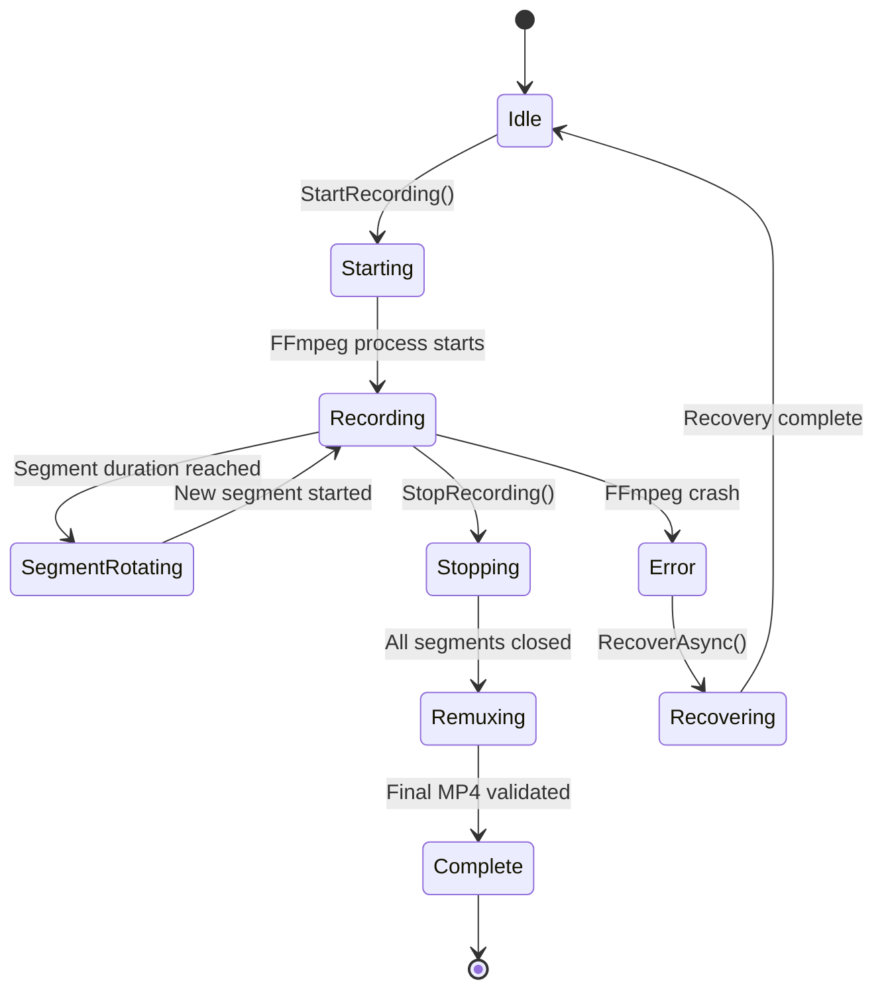
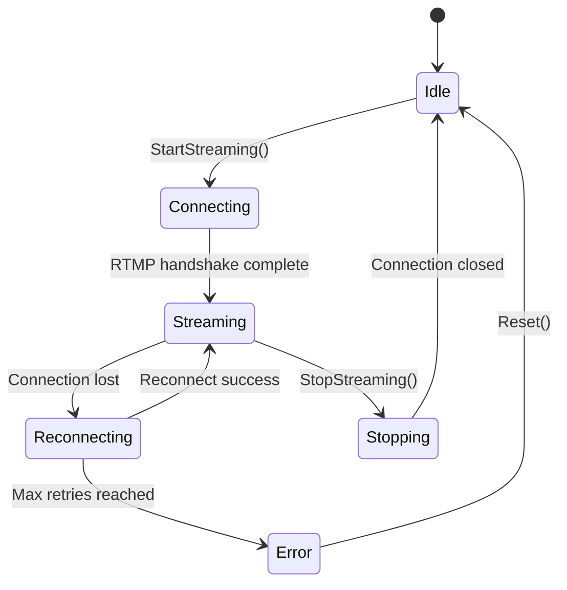

# AMHARC Match Capture — Component Definitions

**Version:** 0.1.0  
**Date:** July 2026

---

## 1. CameraAdapter (Interface: ICameraAdapter)

**Purpose:** Abstracts all camera-specific behaviour behind a common interface.

**Responsibilities:**
- Connect to and authenticate with a camera
- Retrieve camera identity, stream profiles, supported resolutions, frame rates and codecs
- Start and stop live video
- Report connection state and camera health
- Attempt automatic reconnect after failure

**Key interface methods:**
- `ConnectAsync()` — establish RTSP connection
- `DisconnectAsync()` — close RTSP connection
- `GetStreamUrlAsync()` — return the RTSP stream URL for the active profile
- `GetCameraInfoAsync()` — return model, serial number, firmware version
- `GetConnectionState()` — return current `CameraConnectionState`
- `ReconnectAsync()` — attempt reconnection after failure

---

## 2. AxisCameraAdapter (Implements ICameraAdapter, IAxisPtzController)

**Purpose:** Concrete implementation for AXIS Q6128-E and compatible Axis cameras.

**Responsibilities:**
- Connect using RTSP with digest authentication
- Retrieve camera information using AXIS VAPIX API
- Implement PTZ via AXIS VAPIX CGI commands
- Support Axis stream profiles
- Handle Axis-specific error codes
- Log Axis-specific events in structured format

**Dependencies:** VAPIX HTTP API, RTSP, ONVIF (optional)

---

## 3. StreamReceiver (Interface: IStreamReceiver)

**Purpose:** Receives the live RTSP video stream and exposes it to multiple consumers.

**Responsibilities:**
- Open and maintain the RTSP connection
- Monitor bit rate, frame rate, and dropped frames
- Detect stream interruption
- Provide the video stream to the preview engine, recording engine, overlay engine, and streaming engine

**Implementation note:** Uses FFmpeg or LibVLC as the underlying demuxer. Each consumer receives its own output via FFmpeg tee muxer or GStreamer tee element.

---

## 4. RecordingManager (Interface: IRecordingManager)

**Purpose:** Manages local video recording with resilience as the primary concern.

**Responsibilities:**
- Start and stop recording sessions
- Write MKV segment files at configurable intervals (default: 5 minutes)
- Record the native stream without unnecessary transcoding (stream copy)
- Detect insufficient storage and refuse to start a new segment
- Remux validated segments into final MP4 after the match
- Calculate SHA-256 checksums for final recordings
- Recover incomplete recordings after unexpected shutdown
- Never stop recording solely because of Internet loss, streaming failure, or overlay failure

**State machine:**

---

## 5. PtzController (Interface: IPtzController)

**Purpose:** Generic PTZ control interface.

**Responsibilities:**
- Pan, tilt, zoom (continuous, relative, absolute where supported)
- Set movement speed and zoom speed
- Recall and save named presets
- Return to home position
- Trigger emergency wide view (full-pitch preset)
- Stop all movement
- Report PTZ state

---

## 6. AxisPtzController (Implements IPtzController)

**Purpose:** AXIS VAPIX implementation of PTZ control.

**Responsibilities:**
- Translate generic PTZ commands to VAPIX CGI requests
- Map joystick axis values to VAPIX pan/tilt/zoom speed parameters
- Handle VAPIX error responses
- Report PTZ errors to the health monitor

---

## 7. JoystickService (Interface: IJoystickService)

**Purpose:** Detects and reads a USB joystick for PTZ control.

**Responsibilities:**
- Detect connected joystick via Windows DirectInput or HID
- Read axis positions and button states
- Apply configurable dead zones, sensitivity scaling, and axis inversion
- Map axis values to PTZ commands
- Map buttons to PTZ presets and emergency wide view
- Emit joystick events to the PTZ controller on each poll cycle

---

## 8. StreamDeckService (Interface: IStreamDeckService)

**Purpose:** Manages communication with the Elgato Stream Deck.

**Responsibilities:**
- Detect the Stream Deck via USB HID
- Load the configured button profile (Gaelic football or hurling by default)
- Send visual feedback to buttons (label, icon, background colour)
- Handle short press, long press, and double press
- Create a `MatchEvent` record on each relevant button press
- Support undo of the last event
- Update button states to reflect system status (e.g. period active → AMHARC Lime)

---

## 9. MatchClockService (Interface: IMatchClockService)

**Purpose:** Maintains two independent time values: `matchClockSeconds` and `recordingElapsedSeconds`.

**Responsibilities:**
- Start, pause, resume, reset, correct
- Manage period lifecycle (period-start, period-end, half-time-start, half-time-end, full-time)
- Record every manual correction in an audit log
- Broadcast clock state updates via WebSocket

**Important invariant:** `matchClockSeconds` and `recordingElapsedSeconds` must never be assumed identical. They are kept separate at all times.

---

## 10. EventTaggingService (Interface: IEventTaggingService)

**Purpose:** Creates, edits, deletes and exports match events.

**Responsibilities:**
- Create events with both `matchClockSeconds` and `recordingElapsedSeconds`
- Edit any field of an event
- Soft-delete events (for undo support)
- Assign team, player number, and notes
- Set review status (unreviewed, reviewed, corrected, rejected, flagged)
- Request video clips for an event
- Export filtered events to JSON and CSV
- Maintain an audit trail of all changes

---

## 11. OverlayService (Interface: IOverlayService)

**Purpose:** Generates broadcast overlay graphics.

**Responsibilities:**
- Render scoreboard, match clock, period indicator, team names, and team crest placeholders
- Generate event-triggered graphics (goal, point, card, substitution)
- Produce half-time and full-time summary graphics
- Support three output modes: clean feed, programme feed, overlay-only (transparent for OBS)
- Accept configurable overlay templates (position, fonts, colours, logos, animation)
- Never interfere with the clean recording feed

---

## 12. StreamingService (Interface: IStreamingService)

**Purpose:** Manages RTMP live stream output.

**Responsibilities:**
- Start and stop RTMP stream
- Monitor outgoing bandwidth and dropped frames
- Detect stream failure and attempt automatic reconnect
- Support stream key rotation
- Ensure local recording is never interrupted by streaming events

**State machine:**

---

## 13. StorageMonitor (Interface: IStorageMonitor)

**Purpose:** Monitors available disk space and provides capacity estimates.

**Responsibilities:**
- Read available space from the configured recording drive
- Calculate estimated remaining recording minutes at the current bitrate
- Emit warnings at configurable thresholds (default: 90 minutes and 30 minutes remaining)
- Refuse to start a new segment if below the minimum storage threshold
- Detect disconnected external storage

---

## 14. ExportService (Interface: IExportService)

**Purpose:** Exports all match data in structured, versioned formats.

**Responsibilities:**
- Export events as JSON (full event schema)
- Export events as CSV (flat representation)
- Generate AMHARC Match Capture Manifest (versioned JSON, format version 1)
- Export recording manifest (segment list, checksums, durations)
- Export camera metadata and technical log

---

## 15. HealthMonitoringService (Interface: IHealthMonitoringService)

**Purpose:** Monitors all system components and generates operator warnings.

**Monitored components:**
- Camera (connection state, bitrate, dropped frames)
- Recording (active, elapsed time, segment count, disk space)
- Streaming (active, bandwidth, dropped frames)
- Stream Deck (connected, active profile)
- Joystick (connected)
- Overlay renderer (active)
- Audio source (level, clipping)
- Local API (response time)

**Outputs:**
- Real-time status indicators via WebSocket
- Operator warning messages (text + icon, never colour alone)
- Structured health events written to SQLite

---

## 16. OperatorInterface

**Purpose:** Web-based control surface for the match operator.

**Pages:**
- Dashboard — system-wide status overview
- Match Setup — create and configure a new match
- Camera Setup — add, configure, and test cameras
- Live Capture — full-screen operator mode with all controls
- Event Timeline — review, edit, and annotate events
- Stream Deck Profile — edit the 15-button profile
- Overlay Setup — configure and preview broadcast graphics
- Streaming Setup — configure destinations and control live stream
- System Health — detailed health status for all components
- Exports — export match data and download files
- Settings — system configuration

---

*AMHARC Match Capture — Component Definitions v0.1.0*
