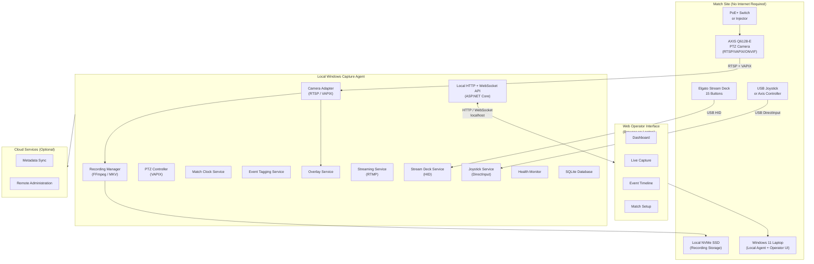
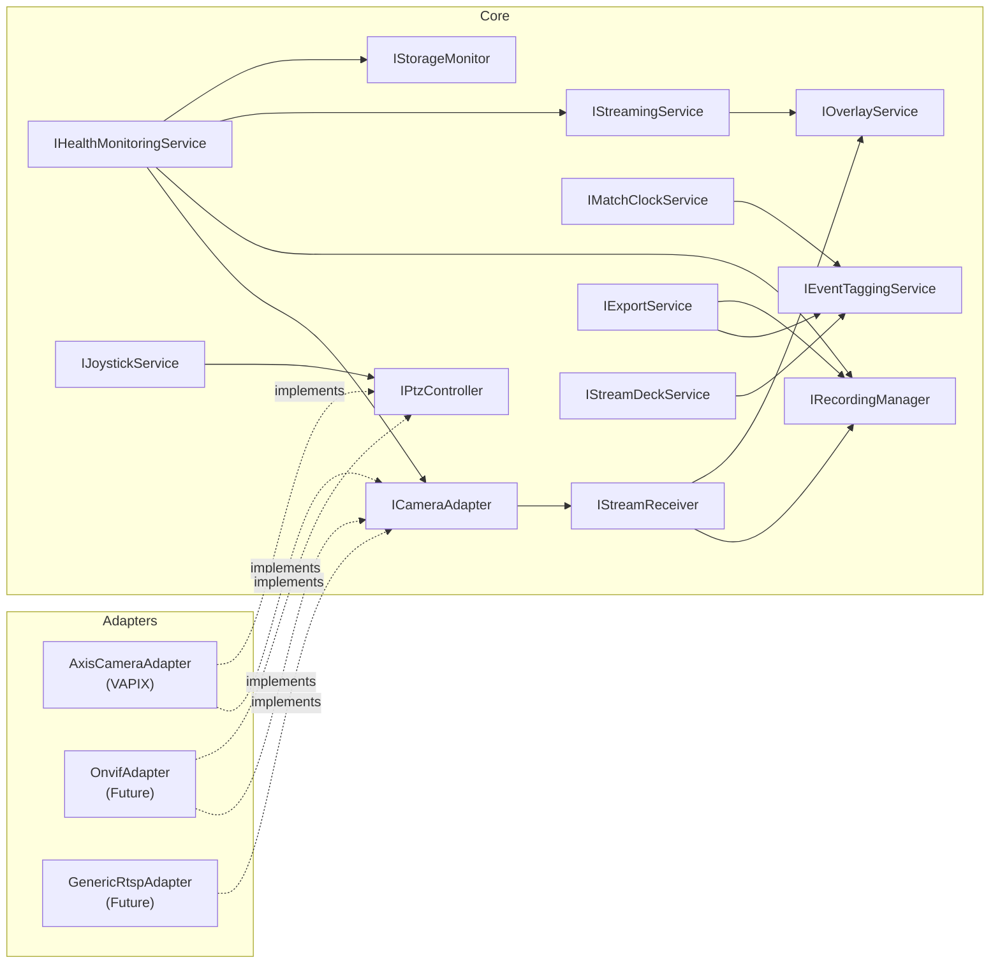
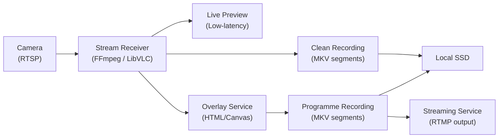
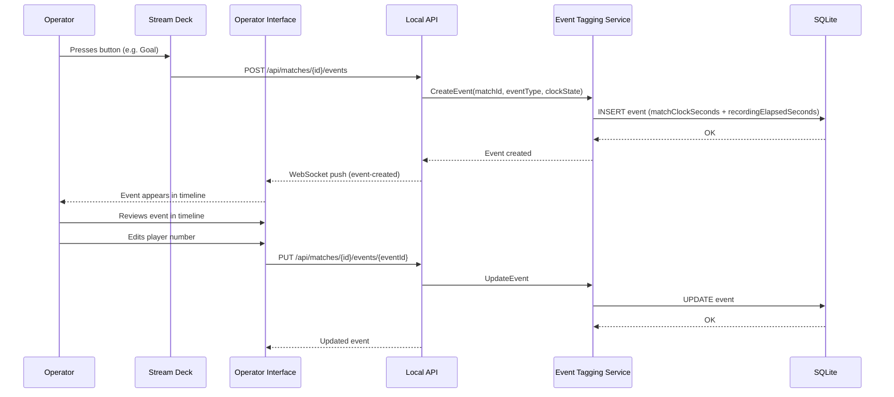

# AMHARC Match Capture — Solution Architecture

**Version:** 0.1.0  
**Date:** July 2026

---

## 1. System Context

AMHARC Match Capture operates as a hybrid system with three runtime environments.

---

## 2. Component Architecture

The local agent is structured as a set of loosely coupled services communicating through well-defined interfaces.

---

## 3. Runtime Architecture

The system runs four main processes on the Windows laptop.

| Process | Technology | Port | Role |
|---------|------------|------|------|
| Local Agent | C# / ASP.NET Core | 5000 (localhost) | Core hardware integration, recording, events, API |
| Operator Interface | React / Vite | Browser | Operator control surface |
| Overlay Renderer | React / Vite | 5001 (localhost) | OBS browser source for broadcast overlays |
| SQLite DB | SQLite | File | Persistent local data store |

---

## 4. Media Flow

**Key principles:**
- The clean recording uses stream copy (no re-encoding) to preserve the native bitstream.
- The programme recording adds overlay graphics; hardware encoding is used where supported.
- Recording is independent of streaming. Streaming failure never stops recording.

---

## 5. Data Flow

---

## 6. Failure Behaviour

| Failure | Recording | Streaming | Clock | Events |
|---------|-----------|-----------|-------|--------|
| Internet loss | ✅ Continues | ❌ Stops (reconnects) | ✅ Continues | ✅ Continues |
| Streaming failure | ✅ Continues | ❌ Stops (reconnects) | ✅ Continues | ✅ Continues |
| Overlay failure | ✅ Continues | ⚠️ Clean feed only | ✅ Continues | ✅ Continues |
| Application crash | ⚠️ Segments preserved | ❌ Stops | — | ⚠️ Last events may be lost |
| Camera disconnect | ⚠️ Segment closes | ❌ Stops | ✅ Continues | ✅ Continues |
| Storage full | ❌ Cannot start new segment | — | ✅ Continues | ✅ Continues |
| Power loss | ⚠️ MKV recoverable | ❌ Stops | — | ⚠️ Committed events preserved |

---

## 7. Security Boundaries

- The local API listens only on `127.0.0.1:5000` by default.
- Camera credentials are stored using Windows Credential Manager (DPAPI encryption).
- Stream keys are encrypted using AES-256 before storage in SQLite.
- No camera credentials are ever written to logs.
- The overlay renderer is served locally; it is not exposed externally.
- Remote administration (if enabled) requires authenticated HTTPS with JWT.

---

## 8. Local-First Design

The system treats Internet connectivity as entirely optional.

**Core match operations that must work without Internet:**
- Camera connection and RTSP stream
- PTZ control (VAPIX over local Ethernet)
- Recording to local SSD
- Match clock and scoreboard
- Stream Deck event tagging
- Broadcast overlays
- SQLite event persistence
- Export to local filesystem

**Operations that require Internet (optional):**
- RTMP live streaming
- Cloud metadata synchronisation
- Remote administration

---

*AMHARC Match Capture — Solution Architecture v0.1.0*
