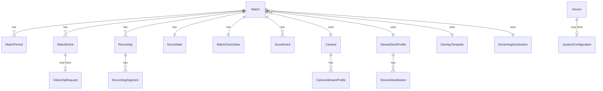

# AMHARC Match Capture — Data Model

**Version:** 0.1.0  
**Date:** July 2026

---

## 1. Entity Overview

---

## 2. Entity Definitions

### Match

| Field | Type | Required | Notes |
|-------|------|----------|-------|
| matchId | UUID | Yes | Internal unique identifier |
| humanId | String | Yes | Human-readable ID, e.g. `AMHARC-2026-000145` |
| sport | Enum | Yes | `gaelic-football`, `hurling`, `ladies-football`, `camogie` |
| competition | String | Yes | e.g. `Senior Hurling Championship` |
| season | String | Yes | e.g. `2026` |
| round | String | No | e.g. `Round 3` |
| date | Date | Yes | ISO 8601 date |
| venue | String | No | Venue name |
| homeTeam | String | Yes | Full team name |
| awayTeam | String | Yes | Full team name |
| homeTeamShort | String | No | Short code, e.g. `BRI` |
| awayTeamShort | String | No | Short code |
| homeTeamCrestUrl | String | No | Path to crest image |
| awayTeamCrestUrl | String | No | Path to crest image |
| homeTeamColour | String | No | Hex colour |
| awayTeamColour | String | No | Hex colour |
| operator | String | No | Operator name |
| scheduledStart | DateTime | No | ISO 8601 datetime |
| periodStructure | Enum | Yes | `halves`, `quarters`, `custom` |
| expectedDurationMinutes | Integer | No | Total expected match duration |
| recordingDirectory | String | No | Absolute path on local filesystem |
| cameraId | UUID | No | FK → Camera |
| streamProfileName | String | No | Name of stream profile to use |
| overlayTemplateId | UUID | No | FK → OverlayTemplate |
| streamDestinationId | UUID | No | FK → StreamingDestination |
| notes | Text | No | Free-form operator notes |
| status | Enum | Yes | `setup`, `ready`, `active`, `halftime`, `complete`, `cancelled` |
| currentPeriod | Integer | No | 1 or 2 (halves) or 1–4 (quarters) |
| createdAt | DateTime | Yes | |
| updatedAt | DateTime | No | |

### Camera

| Field | Type | Required | Notes |
|-------|------|----------|-------|
| cameraId | UUID | Yes | |
| name | String | Yes | Operator-assigned name |
| manufacturer | Enum | Yes | `axis`, `canon`, `panasonic`, `sony`, `ptzoptics`, `birddog`, `aver`, `bolin`, `onvif`, `generic-rtsp` |
| adapter | String | Yes | Adapter class name |
| model | String | No | e.g. `AXIS Q6128-E` |
| ipAddress | String | Yes | Camera IP address |
| rtspUrl | String | Yes | Full RTSP stream URL |
| credentialRef | String | No | Reference to Windows Credential Store entry |
| streamProfile | String | No | Default stream profile name |
| codec | String | No | e.g. `H.264` |
| resolution | String | No | e.g. `1920x1080` |
| frameRate | Integer | No | |
| hasAudio | Boolean | No | |
| connectionState | Enum | Yes | `connected`, `disconnected`, `connecting`, `error` |
| firmwareVersion | String | No | |
| serialNumber | String | No | |
| createdAt | DateTime | Yes | |
| updatedAt | DateTime | No | |

### Recording

| Field | Type | Required | Notes |
|-------|------|----------|-------|
| recordingId | UUID | Yes | |
| humanId | String | Yes | e.g. `REC-000001` |
| matchId | UUID | Yes | FK → Match |
| cameraId | UUID | Yes | FK → Camera |
| cameraRole | String | Yes | e.g. `primary-ptz` |
| recordingDirectory | String | Yes | Absolute path |
| status | Enum | Yes | `recording`, `stopped`, `remuxing`, `complete`, `error`, `recovered` |
| startTimestamp | DateTime | Yes | UTC |
| stopTimestamp | DateTime | No | |
| durationSeconds | Integer | No | Computed after stop |
| segmentCount | Integer | Yes | |
| finalMp4Path | String | No | Absolute path to remuxed MP4 |
| checksum | String | No | SHA-256 hex digest |
| createdAt | DateTime | Yes | |

### RecordingSegment

| Field | Type | Required | Notes |
|-------|------|----------|-------|
| segmentId | UUID | Yes | |
| recordingId | UUID | Yes | FK → Recording |
| segmentNumber | Integer | Yes | 1-based index |
| filePath | String | Yes | Absolute path to MKV file |
| startTimestamp | DateTime | Yes | |
| endTimestamp | DateTime | No | |
| durationSeconds | Integer | No | |
| fileSizeBytes | Integer | No | |
| isComplete | Boolean | Yes | `false` if closed unexpectedly |
| checksum | String | No | |

### MatchEvent

| Field | Type | Required | Notes |
|-------|------|----------|-------|
| eventId | UUID | Yes | |
| humanId | String | Yes | e.g. `EVT-000127` |
| matchId | UUID | Yes | FK → Match |
| eventType | Enum | Yes | See event type list |
| team | Enum | No | `home`, `away` |
| playerId | UUID | No | FK → Player (future) |
| playerNumber | Integer | No | Jersey number |
| period | Integer | Yes | |
| matchClockSeconds | Integer | Yes | Seconds on match clock at time of event |
| recordingElapsedSeconds | Integer | Yes | Seconds into the recording at time of event |
| systemTimestamp | DateTime | Yes | UTC timestamp from system clock |
| source | Enum | Yes | `operator-ui`, `stream-deck`, `joystick`, `system`, `imported`, `api`, `automatic` |
| operator | String | No | |
| note | Text | No | |
| scoreBefore | String | No | Score string before event |
| scoreAfter | String | No | Score string after event |
| clipRequested | Boolean | Yes | Default `false` |
| reviewStatus | Enum | Yes | `unreviewed`, `reviewed`, `corrected`, `rejected`, `flagged` |
| isDeleted | Boolean | Yes | Soft delete for undo |
| createdAt | DateTime | Yes | |
| updatedAt | DateTime | Yes | |

### ScoreState

| Field | Type | Required | Notes |
|-------|------|----------|-------|
| matchId | UUID | Yes | PK, FK → Match |
| homeGoals | Integer | Yes | Default 0 |
| homePoints | Integer | Yes | Default 0 |
| awayGoals | Integer | Yes | Default 0 |
| awayPoints | Integer | Yes | Default 0 |
| homeTotal | Integer | Yes | Computed: goals×3 + points |
| awayTotal | Integer | Yes | Computed: goals×3 + points |
| updatedAt | DateTime | No | |

### MatchClockState

| Field | Type | Required | Notes |
|-------|------|----------|-------|
| matchId | UUID | Yes | PK, FK → Match |
| matchClockSeconds | Integer | Yes | Current match clock value |
| recordingElapsedSeconds | Integer | Yes | Current recording elapsed value |
| isRunning | Boolean | Yes | |
| currentPeriod | Integer | Yes | |
| clockMode | Enum | Yes | `count-up`, `count-down` |
| startedAt | DateTime | No | When clock was last started |
| updatedAt | DateTime | No | |

**Invariant:** `matchClockSeconds` and `recordingElapsedSeconds` must always be maintained independently. The system must never assume they are equal.

### StreamDeckProfile

| Field | Type | Required | Notes |
|-------|------|----------|-------|
| profileId | UUID | Yes | |
| name | String | Yes | |
| sport | Enum | Yes | Sport or `custom` |
| isDefault | Boolean | Yes | |
| createdAt | DateTime | Yes | |

### StreamDeckButton

| Field | Type | Required | Notes |
|-------|------|----------|-------|
| buttonId | UUID | Yes | |
| profileId | UUID | Yes | FK → StreamDeckProfile |
| buttonNumber | Integer | Yes | 1–15 |
| label | String | Yes | |
| icon | String | No | Icon identifier or path |
| colour | String | No | Hex colour for button background |
| eventType | String | Yes | Maps to MatchEvent.eventType |
| team | Enum | No | `home`, `away` |
| scoreEffect | String | No | `goal`, `point`, `two-point` |
| overlayEffect | String | No | Overlay graphic to trigger |
| clipRequest | Boolean | Yes | |
| enabled | Boolean | Yes | |

---

## 3. Event Type Reference

| Event Type | Score Effect | Notes |
|------------|-------------|-------|
| `match-start` | None | System event |
| `match-end` | None | System event |
| `period-start` | None | System or operator event |
| `period-end` | None | System or operator event |
| `half-time-start` | None | |
| `half-time-end` | None | |
| `score` | +1 point | Generic score increment |
| `goal` | +1 goal | Worth 3 points in totals |
| `point` | +1 point | |
| `two-point-score` | +2 points | Gaelic football special rule |
| `shot` | None | Shot attempt, no score |
| `kick-out` | None | Gaelic football |
| `puck-out` | None | Hurling |
| `turnover` | None | |
| `free` | None | |
| `mark` | None | Gaelic football |
| `sideline-cut` | None | Hurling |
| `hook` | None | Hurling |
| `block` | None | Hurling |
| `substitution` | None | |
| `card` | None | Yellow or red |
| `injury` | None | |
| `major-incident` | None | |
| `highlight` | None | Bookmark for post-match review |
| `technical-issue` | None | Technical recording or stream issue |
| `custom-event` | None | Operator-defined |

---

*AMHARC Match Capture — Data Model v0.1.0*
